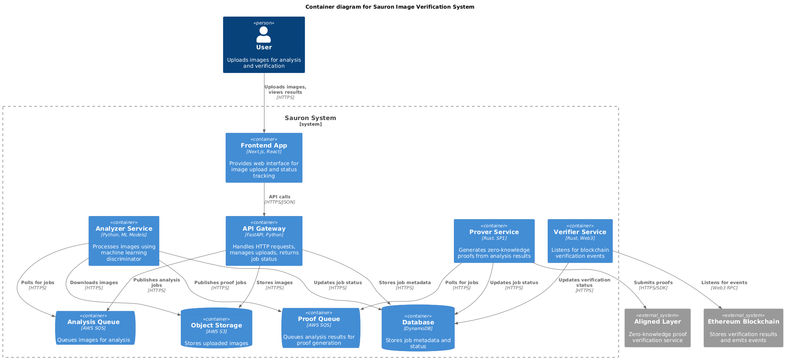

# 🧙‍♂️ Proof of Sauron: AI-Generated Image Detection

**SAURON** : **S**ynthetic **A**nomalies **U**nmasking **R**ecurrent **O**bserved **N**oise.

SAURON is an innovative open-source framework that detects AI-generated images using advanced statistical and frequency-domain analysis techniques, then wraps the detection results in a zero-knowledge proofs for a single source of truth.

## Overview

This project combines cutting-edge AI detection algorithms with blockchain technology to create a trustless system for identifying synthetic images.

### Key Features

- **Advanced AI Detection**: Multi-modal analysis using Shannon entropy, FFT, inter-pixel correlation, texture statistics, and wavelet transforms

## Project Structure

```
proof-of-sauron-poc/
├── python/              # Core AI detection engine
│   ├── sauron-core/        # Main detection algorithms
│   ├── sauron-api/         # REST API service
│   └── sauron-shared/      # Shared utilities
├── rust/                # Zero-knowledge
│   ├── sauron-proof/       # SP1 zkVM implementation
│   └── sauron-prover/      # Proof generation service
├── frontend/            # Next.js web application
└── Dockerfile          # Containerization
```

## Architecture


## AI Detection Engine

The Python-based core engine (`python/sauron-core/`) implements sophisticated image analysis techniques:

### Feature Extraction Modules

- **`entropy.py`**: Local Shannon entropy analysis for detecting artificial patterns
- **`spatial.py`**: Inter-pixel correlation and spatial frequency analysis  
- **`texture.py`**: Texture statistics and pattern recognition
- **`wavelets.py`**: Wavelet transform-based frequency domain analysis
- **`noise.py`**: Noise pattern detection and analysis

## Quick Start

### Prerequisites

- **Python 3.13+** with Poetry
- **Rust 1.70+** with Cargo
- **Node.js 18+** with npm/yarn
- **Docker** (optional)

### Installation

1. **Clone the repository**
   ```bash
   git clone https://github.com/your-org/proof-of-sauron-poc.git
   cd proof-of-sauron-poc
   ```

2. **Setup Python environment**
   ```bash
   cd python/sauron-core
   poetry install
   poetry shell
   ```

4. **Setup frontend**
   ```bash
   cd frontend
   npm install
   npm run dev
   ```

## Detection Methodology

SAURON employs a multi-layered approach to identify AI-generated images:

### Statistical Analysis
- **Shannon Entropy**: Measures information density across image regions
- **Pixel Correlation**: Analyzes inter-pixel relationships and dependencies
- **Distribution Analysis**: Examines pixel value distributions for anomalies

### Frequency Domain Analysis
- **Fast Fourier Transform**: Detects artificial frequency patterns
- **Wavelet Decomposition**: Multi-resolution analysis for hidden artifacts
- **Spectral Density**: Identifies unnatural frequency components

### Texture and Pattern Recognition
- **Local Binary Patterns**: Captures micro-texture characteristics
- **Gray-Level Co-occurrence**: Analyzes spatial pixel relationships
- **Gradient Analysis**: Detects artificial edge patterns

*Built with 🧙‍♂️ by the Ratherlabs team*